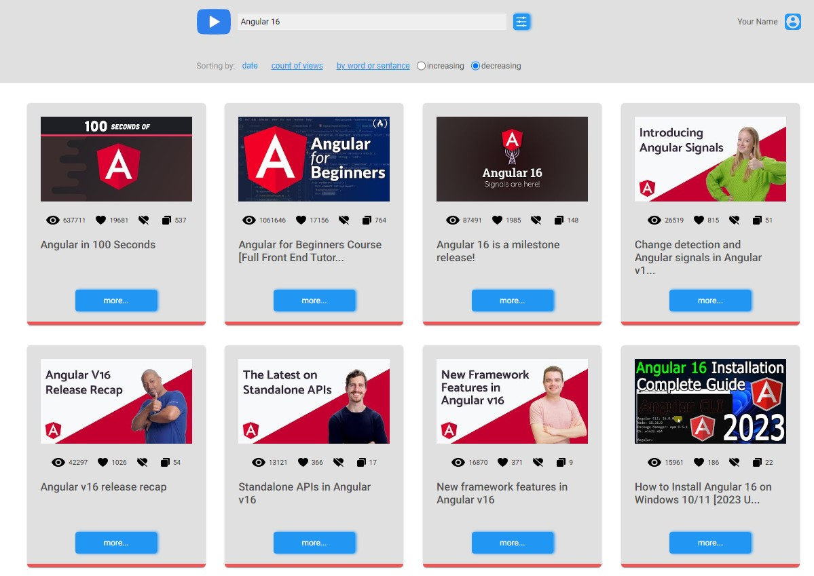

# Youtube Client App

What it is:

This is a web application that allows you to search youtube videos to see details and to create custom videos. If you want to search videos first you have to login this app which is filled the login form. After successfully login, you able to search, sort and filter youtube videos. You can also use this application as admin who can build custom videos.

Installation:
To build, download the files from the repository and install the dependencies use npm: npm install. After that, type 'npm run start' in console to run application in development mode, or 'npm run build' to get built bundle (appears in dist folder).

Deployed version you can find [here](https://youtube-client-app-rust.vercel.app/).

Technologies: Angular, TypeScript, Redux, RxJs, SCSS, jest, eslint.

Technical features:
- Auth form implemented with form validation
- Searching youtube videos and sorting and filtering on the result videos 
- Created admin page for create custom videos
- Using redux for state management
- Implement jest for testing
